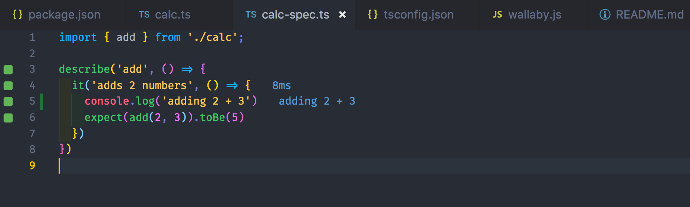

# test-wallaby

Example Jest + TypeScript project with [Wallaby.js](https://wallabyjs.com/) configured

## Resources

- https://wallabyjs.com/docs/intro/get-started-vscode.html
- https://wallabyjs.com/docs/integration/typescript.html

## Files

- [src/calc.ts](src/calc.ts)
- [src/calc-test.ts](src/calc-test.ts)
- [wallaby.js](wallaby.js) shows Node configuration for Jest + TypeScript

## Coverage

Test lines covered during execution, including output values

## Note

When starting Wallaby, make sure to look at its output. It will show possible errors there (and a solution!)

